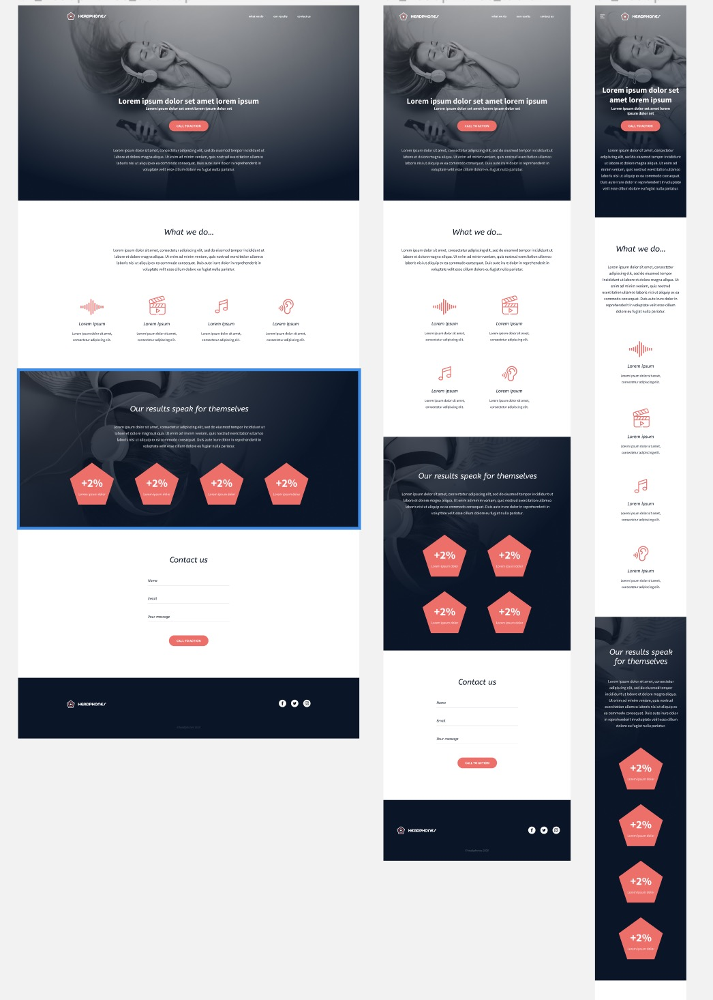

# Headphones

Implementation of a webpage design without using any library, just pure HTML and CSS.

### Objective
---
The objective is simple: Have a fully functional web page that looks the same as the designer file below.

### Designer File - images
---

#### Desktop, Tablet and mobile

This webpage has been designed by Nicolas Philippot, UI/UX designer.
## Authors

- [Tareq Al-Dhaifani](https://www.github.com/aldhaifani)

## License

This project was done as part of the [ALX Intro To SWE](https://alxintrotoswe.com/) learning program. Therefore, the content of this project including the assets belong to [ALX Intro To SWE](https://alxintrotoswe.com/).

